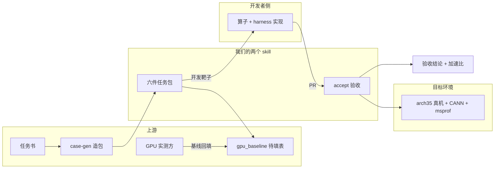
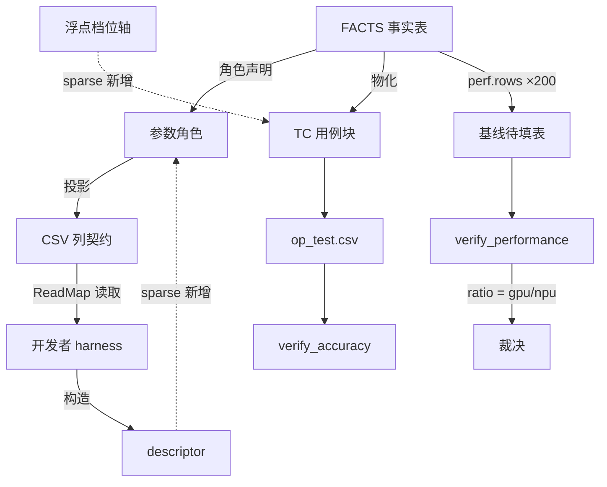

# sparse 支持差距学习地图

> 回答一个问题：两个 blas skill（repo-task-blas-case-gen / repo-task-blas-accept）距离支持
> `cann/ops-sparse` 还差什么。面向心智模型与世界模型，不面向操作步骤。
> 事实基线：2026-08-31 对 ops-sparse 仓的实探（35 算子、`test/<op>/arch35/` 布局、
> descriptor 风格 API、`fill_sparse.h`/`descriptor_manager.h` 框架件、`coo2csr_test.csv` 列契约）
> 与本轮已定决策。

## 0. 差距总表（TL;DR）

| 编号 | 差距                                                | 层次   | 状态                |
| -- | ------------------------------------------------- | ---- | ----------------- |
| A1 | accept 环境门写死 `cann_ops_blas.h`                    | 参数级  | 解法已清（硬编码变探测）      |
| A2 | accept 路径模型：无 family 层、arch35 子目录、build 产物路径      | 参数级  | 解法已清（推断适配）        |
| C1 | FACTS 本体：稀疏复合结构、descriptor 签名建模、verify/golden 词表  | 描述层  | 设计方向已清            |
| C2 | 列投影：逐 buffer 填充范式 → 全局结构参数化范式                     | 接口层  | 统一方案已清（角色决定投影）    |
| C3 | 浮点轴：连续量进不了组合引擎与性能键                                | 引擎层  | 解法已清（档位化 + 文本同一性） |
| E1 | arch35 目标真机未探明                                    | 环境   | **最硬前置，未探明**      |
| D1 | references 文档的 sparse 章节                          | 文档   | 随实现交付             |
| V1 | 核对清单：gtest 套件名、warm-up 次数、状态词表、Task Type、build.sh | 事实核对 | 待真仓核对             |

已裁定、从清单划掉的：块命名统一用 `TC_<块>_`；sparse v1 不做 footprint 估算；
任务发放物按六件；性能用例固定 200 条 + 空 `gpu_ms` 待填基线。

## 1. 本质（Essence）

**一句话：这组差距是「一条为稠密 BLAS 打造的确定性验收流水线」与「稀疏算子世界」之间的
表达力落差——不是功能缺失，而是本体、接口、引擎三层各有一条稠密隐含假设被稀疏打破。**

**为什么它存在。** 流水线的通用性来自一条设计：变化隔离在数据（FACTS），机制全部共享。
隔离边界当年按稠密世界划定——buffer 是矩形数组、轴是整数与枚举、数据按 buffer 逐个描述。
稀疏世界在这三处都越了界，于是「换一份 FACTS 就支持新算子」的承诺失效了。

**它解决什么根本问题。** 让 sparse 任务进入同一条「六件发放 → 开发者实现 → 机械验收」
流水线：确定性造包、pairwise 覆盖、逐用例对 GPU 基线的加速比裁决、可审计的验收结论。
更深一层：证明这条流水线的通用性是真的——第一个新域接入的成本，就是通用性的度量。

**没有它时人们怎么办。** 人肉写用例（覆盖靠手感）、人肉验收（结论不可复现）、
每算子一份专用脚本（事实与机制搅在一起，N 个算子 N 份要审的程序）。

**它带来的新可能。** sparse 算子获得 200 点加速比曲线、组合覆盖的缺陷检出力
（blas 侧实证：pairwise 集抓到旧包从未暴露的 18 个真实缺陷）、零上下文的可复核验收。

## 2. 世界模型（World Model）

- **对象（Objects）**：任务书、六件包（gen\_csv.py / CSV / 两个 verify / README / 基线表）、
  FACTS、harness、descriptor、真机容器、验收报告。
- **角色（Actors）**：任务发布方（定形状、测 GPU）、开发者（写算子和 harness）、
  验收 agent（跑 skill）、上游仓维护者（框架惯例的所有者）。
- **状态变迁（State）**：任务书 → 六件发放（基线空置）→ GPU 回填 → 开发者提 PR →
  A2–A5 验收 → 结论。每一步的产物都是下一步的契约。
- **工作流改变（Workflow）**：包先于代码——六件是开发者要命中的靶子，不是对既有工程的描述。
- **交互系统（Systems）**：ops-sparse 仓（API 与测试框架）、gtest、msprof、CANN 工具链。
- **价值（Value）**：可复现的裁决、逐点加速比证据、系统性覆盖的缺陷检出。

**生态位**：两个 skill 站在任务发布方和开发者之间，充当「契约的物化者」——
把任务书的事实变成机器可校验的包，把 PR 的行为变成机器可裁决的结论。

## 3. 概念地图（Concept Map）

**第一层：造包域**

| 概念    | 动词    | 目的              | 关系                       |
| ----- | ----- | --------------- | ------------------------ |
| FACTS | 声明    | 收纳算子间的全部差异      | 一切下游的推导源                 |
| 参数角色  | 分类    | 决定引擎怎么对待每个参数    | C1 的扩展点（稀疏结构、descriptor） |
| 列投影   | 翻译    | 角色 → CSV 列的机械映射 | C2 的统一规则所在               |
| 组合引擎  | 枚举/判重 | pairwise 覆盖与唯一性 | C3 的离散性前提所在              |

**第二层：验收域**

| 概念       | 动词          | 目的                    | 关系                   |
| -------- | ----------- | --------------------- | -------------------- |
| A2–A5 链  | 推断/渲染/执行/裁决 | 从任意六件包到结论             | 对 sparse 只需 A1/A2 适配 |
| 运行时包     | 渲染          | 量具与包解耦                | 与领域无关，原样复用           |
| ratio 判据 | 相除          | `gpu_ms/npu_ms ≥ 0.8` | 秤（基线）与样本（用例）分离       |

**第三层：领域差异（sparse 引入的新概念）**

| 概念         | 是什么                         | 归属                 |
| ---------- | --------------------------- | ------------------ |
| descriptor | 打包稀疏矩阵全部元信息的 API 对象         | 仓库 API 的既成事实，我们只描述 |
| 稀疏结构       | 多个经 nnz 耦合的数组 + 内容级不变量      | FACTS 需新增的本体对象     |
| 全局结构参数     | sparsity/pattern 这类描述整个结构的列 | 新方言的列投影目标          |
| 浮点档位       | 连续量切成的离散档                   | 引擎以文本 token 消费     |

## 4. 决策地图（Decision Map）

**场景一：拿到一份 sparse 任务书，要发任务包**
↓ 决策：检查 C1–C3 是否已落地；未落地则不能发（六件必须由 case-gen 生成，红线禁止手写）
↓ 理由：六件之一就是生成器本身，check 靠它逐字节复核
↓ 预期：C1–C3 落地后，发放物与 blas 完全同构

**场景二：收到 sparse 算子 PR，要验收**
↓ 决策：先确认 arch35 真机可用（E1），再做 A1/A2 两处小改
↓ 理由：代码 gap 都能写，没有对的机器 A3–A5 一步走不了
↓ 预期：机器就位后，accept 统一路径原样吃 sparse 六件包

**场景三：任务书没给 GPU 性能数据**
↓ 决策：照发六件——200 点位、`gpu_ms` 全空的待填表
↓ 理由：基线是任务书的输入职责；「没要求」是通过，「有要求没秤」是证据不足，两种收敛都定义好了
↓ 预期：GPU 侧任何时候回填，配上数的行自动升级为可裁决，免重渲染

**场景四：验收结果出现批量 SKIP 或性能全 FAIL**
↓ 决策：先查环境机制（内存护栏读 cgroup、构建类型），再谈算子缺陷；必要时做单变量对照
↓ 理由：blas 实战两次教训——n=8000 SKIP 是护栏兜底 2 GB，性能 FAIL 是仓库写死 Debug/-O0
↓ 预期：结论按契约如实记，归因作对照证据附上，两者不混

**场景五：要改两 skill 的共享层（引擎、模板、accept 路径）**
↓ 决策：blas 的机械回归门先行（cherk/sasum 示例 check 退出码 0），动核心裁决逻辑无条件过 Codex
↓ 理由：blas 刚在真机验证过全链路，共享层改动的最大风险是打碎这份已验证性
↓ 预期：sparse 支持不以 blas 回归为代价

## 5. 搜索空间扩展（Search Space Expansion）

**初学者通常不会想到的问题**

- 事实来源是分层的：逐算子事实只来自任务书；框架惯例（词表、descriptor 机制）来自仓库
  `test/frame/`，先于任何算子存在——所以 case-gen 不需要算子工程存在。
- OOM 的瓶颈在 host 内存不在显存：一条用例 host 侧要持有 3–5 份稠密副本（造数 + golden +
  比对），而容器 cgroup 不限额时护栏反而退回 2048 MB 保守兜底。
- 错估比不估糟：稠密 footprint 公式套在稀疏上是系统性高估，会误拒合法用例——
  这是 v1 砍掉 sparse footprint 的原因（假阳性硬失败 > 运行时 SKIP 兜底）。
- 任务书标杆表的数值可能已除过阈值（NPU 上限 = GPU 实测 ÷ 0.8），单位可能是 us——
  抄进 FACTS 前要核口径，抄错一千倍 A4 全体误判。

**专家真正关心的问题**

- 裁决路径唯一性：任何 sparse 化改造都不许出现第二套裁决实现。
- 方言以数据存在还是以代码分枝存在：能塌成「角色决定投影」一条规则的，就不该是模板里的 if。
- 契约漂移的检测面：文档宣称的每一条，机械门是否真的兜住（本轮 Codex 评审抓过一次
  「文档说两侧报错、实际只有一侧」）。
- 任务书完整性门槛：sparse 任务书必须承载完整 C 原型（含 descriptor 参数）和结构参数语义；
  给不全就打回补齐，不替它发明。

**下一步值得探索**

- E1：arch35 对应哪台真机、CANN 版本、toolchain——立项第一件事。
- V1 核对清单逐项落实（读 sparse harness 源码即可，半天量级）。
- 浮点档位怎么切才有测试价值（均匀/对数/贴近全稀疏的极端档）——sparse 领域知识。

**决定上限的问题**

- FACTS 本体的表达力天花板：稀疏结构角色之后，batch 稀疏、sparseLt 结构化稀疏、
  更远的算子域还能不能塞进同一套角色系统。
- 任务书模板质量：流水线再确定，输入残缺就只能停在 S1。

## 6. 生态系统（Ecosystem）

- **上游**：任务书（逐算子事实的唯一来源）、GPU 实测（基线数据）、ops-sparse 测试框架
  （列惯例与 descriptor 机制的所有者）、CANN + msprof（度量基础设施）。
- **下游**：开发者 harness（以六件为靶子）、PR 验收结论、加速比-规模曲线。
- **替代方案**：人肉验收（不可复现）、每算子专用脚本（N 份要审的程序）、上游原生 ATK
  skill（另一条流水线，不覆盖 blas/sparse 的 CSV-gtest 惯例）。
- **互补方案**：Codex 六维评审（架构与契约的外部裁判）、isolated-acceptance
  （零上下文真机验收通路）、真机容器纪律（宿主只读、容器内干活）。

## 7. 可迁移原则（Transferable Principles）

**第一性原理（跨项目稳定）**

- 人只做机器做不了的事（从任务书抄事实），机器做人做不稳的事（组合、复现、裁决）。
- 文档宣称的每一条约束，必须有机械门兜住，否则就是未来的谎言。
- 秤与样本分离：基线定义用例，用例产出测量，两者身份永不互换。

**可迁移方法论**

- 变化隔离在数据：新域接入的理想成本是「多几张声明表」，不是「多一套代码」。
- 接口跟消费者走：CSV 列以 harness 实际读什么为准，包迁就代码。
- 失败方向要选对：宁可运行时 SKIP（可见、可兜底），不要生成时误拒（静默丢覆盖）。
- 单变量对照归因：正式结论按契约记，归因实验另附，不混。

**当前实现细节（易变）**：具体列名、词表内容、200 这个数、0.8 阈值、arch 名、目录层级。

**长期稳定 vs 容易变化**：三层假设的位置（本体/接口/引擎）稳定；每层里装的具体内容易变。

## 8. 最小心智模型（Minimum Mental Model）

按重要性排序，前六个足以撑起大部分判断：

1. **六件包**——发放物、开发靶子、验收输入三位一体；生成器自含其中，故手写即违约。
2. **FACTS 分界线**——不确定性只从这一个口进入系统，下游全是确定性推导。
3. **列契约 = ReadMap**——CSV 列以 harness 实际读什么为准；写了不读静默丢，读了没写静默默认。
4. **角色决定投影**——引擎不懂列的语义，只按角色出列、组合、判重；方言差是角色里的数据。
5. **秤与样本**——基线行（不执行）定义性能用例（执行）；「没要求=通过，有要求没秤=证据不足」。
6. **三层假设**——本体（能否描述）、接口（能否翻译）、引擎（能否组合）；新域接入先问哪层破了。
7. **固定 200 + 待填基线**——点位规模是契约不是变量；GPU 数据后补、免重渲染。
8. **ratio 判据的口径**——kernel 设备时长（msprof op\_summary 四类求和 ÷ calls-per-case），
   与 GPU cudaEvent 口径同构，比值才公平。
9. **A2–A5 链**——presence-only 进门、推断、渲染运行时包、执行、裁决；对包零信任前置。
10. **descriptor 归属**——仓库 API 的既成事实，我们只在 FACTS 里描述关系，不设计不实现。
11. **事实来源分层**——逐算子事实↔任务书；框架惯例↔`test/frame/`；两者都不需要算子工程存在。
12. **浮点档位化**——连续轴切档进 FACTS 当数据，引擎按不透明文本判等，离散性前提保住。
13. **TC\_ 块划分**——`TC_PF_` 与其余的二分决定精度/性能期望集；已裁定 sparse 沿用。
14. **机械门**——check 逐字节复核六件；评审抓「文档说了门没兜」的缝。
15. **环境先于代码**——arch35 真机是 sparse 验收的物理前置，其余 gap 都排它后面。

## 9. 常见误区（Common Misconceptions）

| 误区                    | 为什么会产生               | 更准的模型                          |
| --------------------- | -------------------- | ------------------------------ |
| 支持 sparse = 换一份 FACTS | blas 内部加算子确实只换 FACTS | 跨域打破的是三层假设，FACTS 只是其一          |
| 列契约统一 = 统一列名          | 「统一」直觉指向表面           | 列名是 harness 既成事实；统一的是引擎与列的关系   |
| descriptor 要我们设计      | 它出现在我们的 gap 清单里      | 仓库 API 的事实，我们只需能在本体里指称它        |
| case-gen 需要算子工程存在     | 描述符「来自工程」的直觉         | 逐算子事实来自任务书，框架惯例先于算子存在          |
| OOM 是显存不够             | 64G/2T 的直觉对象错了       | 瓶颈是 host 侧稠密副本 + cgroup 护栏兜底   |
| footprint 必须先做        | 「安全检查越多越好」           | 错估比不估糟；v1 靠运行时护栏，实撞再补 nnz 公式   |
| 用例越多覆盖越强              | 数数直觉                 | 旧包 100 条 PF 仅 4 条可裁决；裁决容量由基线决定 |
| 性能测的是端到端              | msprof 包住整个进程        | 采集端到端，取数只累计四类 kernel 的设备时长     |

## 10. 总结（Summary）

**我真正获得的不是一份 sparse 差距清单，
而是一套判定「任何新算子域能否接入这条验收流水线」的世界模型——
先问三层假设（本体能否描述、接口能否翻译、引擎能否组合）哪条被打破，
再问事实从哪来（任务书还是框架）、机械门兜在哪，
最后把方言压成数据、把环境排在代码前面。**
